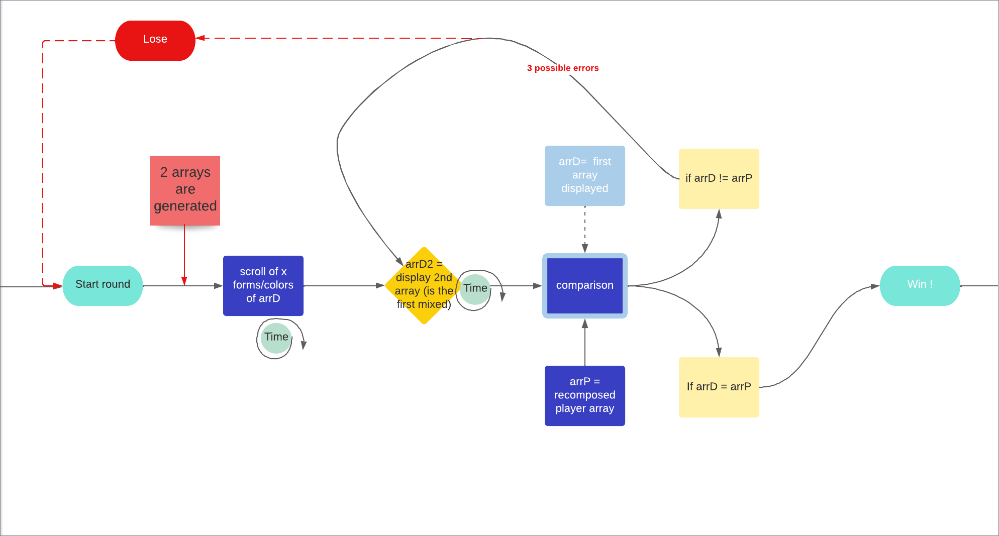

# Memory Game   

Memory game is my JavaScript project to improve my skills with Javascript <span style="color: red">without dedicated tutorial</span>. 

## Rules
 
Pictures scroll one by one on the screen during x seconds, then all pictures are displayed blended x seconds. Player have to select pictures in the same order as they appeared. Score, timer and difficulty levels will be added step by step.


## Playing

Test it on this [website](https://memory-game.sebastiencamacho.fr).

## Conception

<p>First, I draw the logic in lucid.app :</p>

<p>Second, I keep images in a website https://kenney.nl/ and I put them in a pic/ folder. As structure of folder looks like :</p>

```├── pic
    ├── Animals
        ├── Round
            ├──pig.png
            ├──girafe.png
            ├──buffalo.png
            ├──...
        ├── Round-o
            ├──pig.png
            ├──girafe.png
            ├──buffalo.png
            ├──...
        ├── Square
            ├──pig.png
            ├──girafe.png
            ├──buffalo.png
            ├──...
        ├── Square-o
            ├──pig.png
            ├──girafe.png
            ├──buffalo.png
            ├──...
```
I adapted my code to the folder structure, but it's <b style="color:blue">maybe</b> not the rigth way. Rather than generate one path to display a picture, I have to generate two random elements to access the picture : <b style="color:blue">the folder path</b> and <b style="color:blue">the name of picture</b>. Therefor i created const Array to put the elements in : 

```
const animalPath = [                const animals = [
  "Animals/Round/",                 "bear.png",
  "Animals/Round-o/",               "buffalo.png",
  "Animals/Square/",                "chick.png",
  "Animals/Square-o/",              ...
];                                  ];
```
Then each line of random array is generated one by one by calling randomValue() function in boucle for and pushed in the first array

```
export function randomValue(tab) {
  let copy = tab.slice(0);

  return function () {
    if (copy.length < 1) {
      copy = tab.slice(0);
    }
    let index = Math.floor(Math.random() * copy.length);
    let element = copy[index];
    copy.splice(index, 1);
    return element;
  };
}
```
